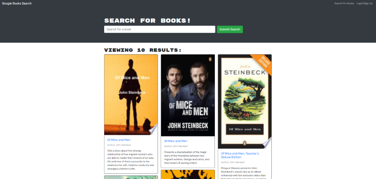
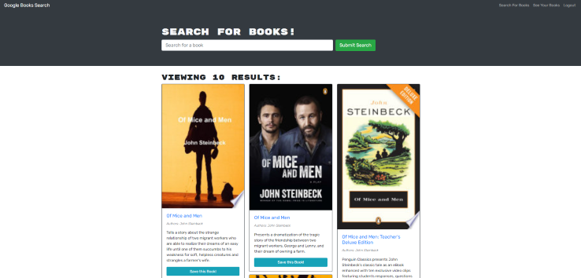
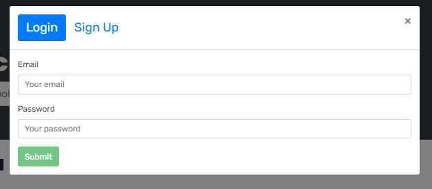
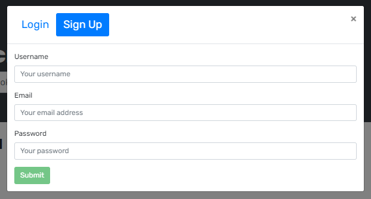
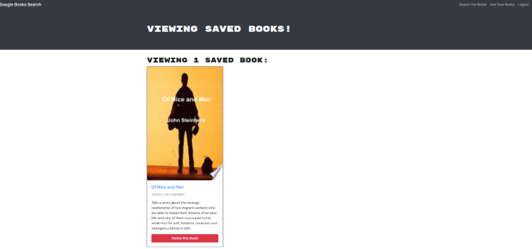

# Book Worm

## Description

AS AN avid reader

I WANT to search for new books to read

SO THAT I can keep a list of books to purchase

## Table of Contents

- [Usage](#usage)
- [Technologies](#technologies)
- [Screenshots](#screenshots)
- [Questions](#questions)

## Usage

Here's a link to the <a href="#">Book Worm</a> deployed application

## Technologies

- NodeJS
- Express.js
- React
- GraphQL
- MongoDB

## Commands to start the application

### Running on local host

To start the application locally use `npm run devlop` in the root of your project directory.

## Screenshots

**Search for book view (logged out user)**

**Search for book view (logged in user)**

**Login/Sign up modals**

**Saved books page**

## Questions

**How to reach me**

- <a href="https://github.com/joesen-dev">Joseph</a>
